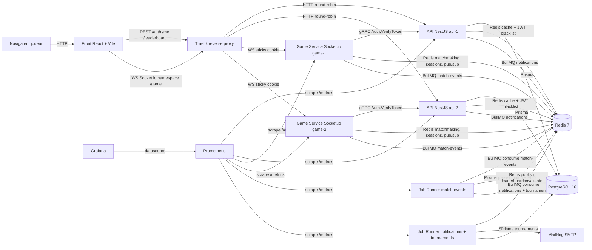
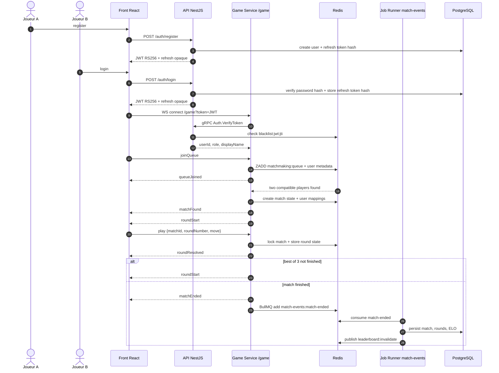
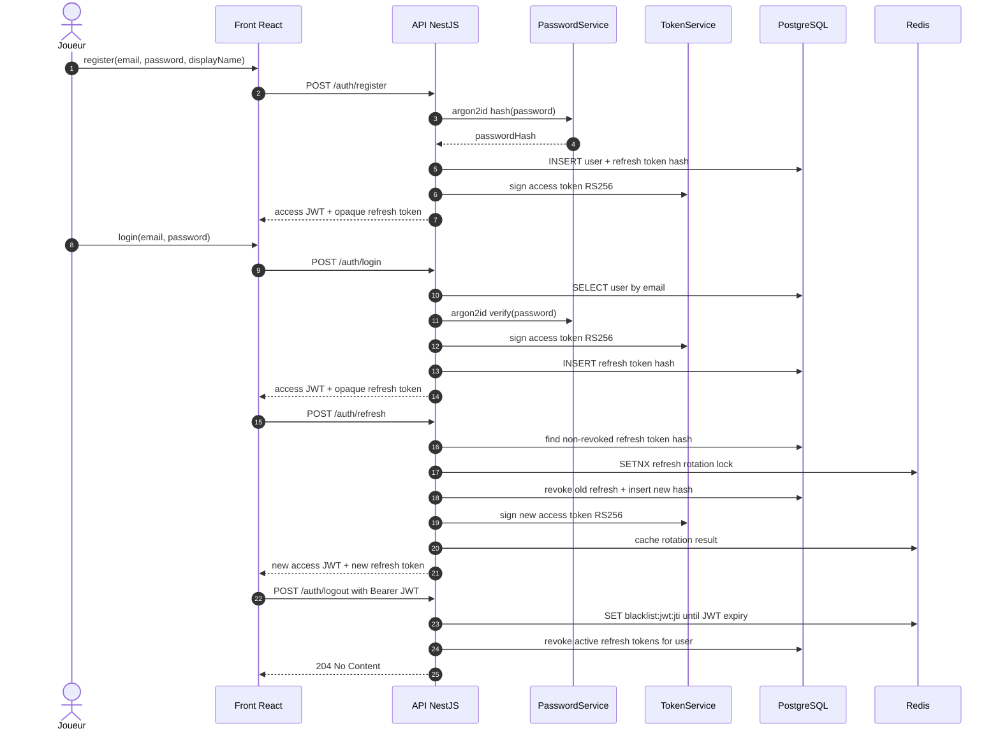

# Architecture Chifoumi Ranked

Ce document donne une vue versionnée des composants déployés, des flux réseau et des traitements asynchrones utiles pour la soutenance.

## Vue d'ensemble

## Flux match complet

## Flux authentification

## Table des services

| Service | Rôle | Port local | URL scale | Dépendances |
|---|---|---:|---|---|
| Front | Interface React/Vite servie en HTTP | `5173` en dev, `80` en conteneur | `http://front.localhost` | API REST, Game WS |
| API `api-1` | API REST NestJS, Swagger, metrics, gRPC auth interne | `3000:3000`, gRPC `50051` interne | `http://api.localhost/health` | PostgreSQL, Redis, BullMQ, clés JWT |
| API `api-2` | Replica API REST pour round-robin | `3002:3000`, gRPC `50051` interne | `http://api.localhost/health` | PostgreSQL, Redis, BullMQ, clés JWT |
| Game Service `game-service-1` | Socket.io `/game`, matchmaking, sessions BO3 en compose de base | `3001:3001` | Non routé par Traefik | Redis, API gRPC `api-1:50051`, BullMQ |
| Game Service `game-service-2` | Replica temps réel en compose de base | `3003:3001` | Non routé par Traefik | Redis, API gRPC `api-2:50051`, BullMQ |
| Game Service `game-1` | Replica temps réel avec sticky routing Traefik | Pas de port direct en scale | `ws://game.localhost/game` | Redis, API gRPC, BullMQ |
| Game Service `game-2` | Replica temps réel avec sticky routing Traefik | Pas de port direct en scale | `ws://game.localhost/game` | Redis, API gRPC, BullMQ |
| Job Runner `match-events` | Persistance des matchs terminés, recalcul ELO, invalidation leaderboard | metrics `3002` interne | Non exposé | Redis BullMQ, PostgreSQL |
| Job Runner `notifications` / `tournaments` | Emails, notifications et jobs planifiés | metrics `3002` interne | Non exposé | Redis BullMQ, PostgreSQL, MailHog |
| PostgreSQL | Stockage users, refresh tokens, matchs, rounds, ELO | `5432` | Non exposé via Traefik | Volume `pg_data` |
| Redis | Cache, blacklist JWT, matchmaking, pub/sub, BullMQ | `6379` | Non exposé via Traefik | Volume `redis_data` |
| Prometheus | Scraping des endpoints `/metrics` | `9090` | `http://prometheus.localhost` | API, Game Service, Job Runner |
| Grafana | Dashboards observabilité pré-provisionnés | `3002:3000` en scale | `http://grafana.localhost` | Prometheus |
| MailHog | SMTP et UI mail de développement | `1025`, `8025` | Non exposé via Traefik | Job Runner, API notifications |

## Notes de lecture

- La stack scale passe par Traefik pour `front.localhost`, `api.localhost`, `game.localhost`, `prometheus.localhost` et `grafana.localhost`.
- L'override de démo `docker-compose.demo.yml` expose seulement `game-1` et `game-2` sur `3101:3001` et `3102:3001` pour forcer un joueur sur chaque replica.
- Le Game Service ne lit pas directement la base applicative pour l'authentification en temps réel : il délègue la vérification JWT à l'API via gRPC.
- Le protocole WebSocket public de jeu utilise l'événement `play`; les champs commit/reveal appartiennent à l'état interne des phases avancées.
- Redis porte à la fois les files BullMQ, la file de matchmaking, les sessions de match, le pub/sub inter-instances et la blacklist des JWT déconnectés.
- La table détaillée des clés Redis est disponible dans [docs/architecture/redis-keys.md](architecture/redis-keys.md).
- Les jobs `match-events` terminent le flux métier après `matchEnded` : persistance, calcul ELO et invalidation du cache leaderboard.
