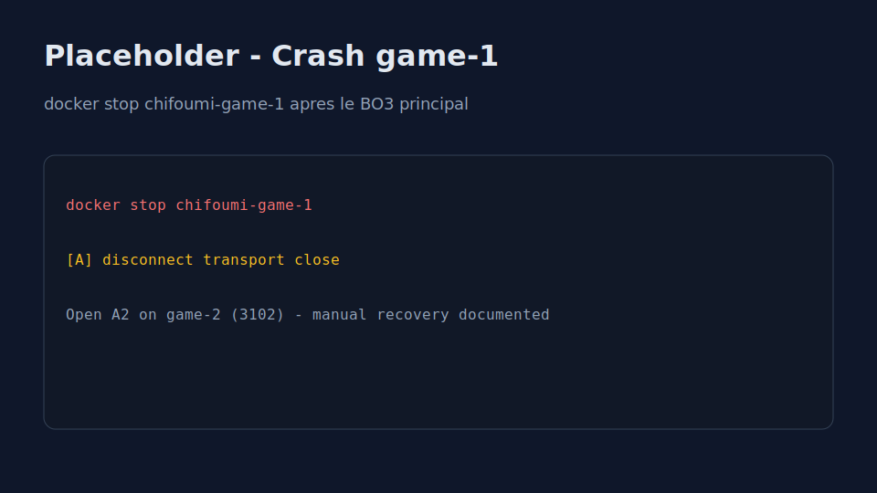
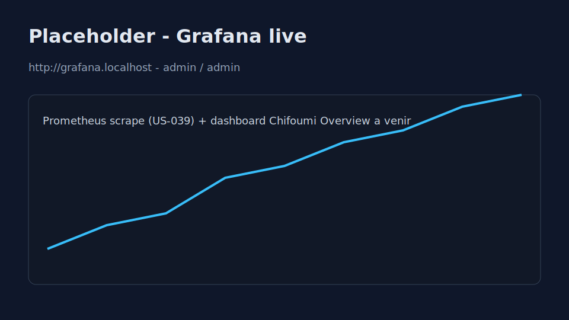

# Demo multi-instances (US-032)

Procedure pas a pas (~5 minutes) pour demontrer la scalabilite horizontale en soutenance : deux replicas Game Service, matchmaking cross-instance, resilience et observabilite.

**Depend de** : [US-030](../backlog/sprint-1-devops-demo.md) (stack scale Traefik).

## Pre-requis

| Element | Detail |
|---|---|
| Docker + Compose | Docker Desktop ou Engine recent |
| OpenSSL | Generation des cles JWT de dev |
| Fichier hosts | Entrees `*.localhost` (voir ci-dessous) |
| Navigateur | 4 fenetres ou profils separes recommandes |
| Temps | ~5 min une fois la stack prete |

### Fichier hosts

Ajouter dans `C:\Windows\System32\drivers\etc\hosts` ou `/etc/hosts` :

```text
127.0.0.1 api.localhost front.localhost game.localhost traefik.localhost grafana.localhost prometheus.localhost
```

### Demarrage automatise (recommande)

**Linux / macOS / Git Bash :**

```bash
bash scripts/demo/run-demo.sh
```

**Windows (PowerShell) :**

```powershell
.\scripts\demo\run-demo.ps1
```

Le script :

1. Genere les cles JWT si absentes (`infra/keys/`).
2. Lance `docker compose -f docker-compose.yml -f docker-compose.scale.yml -f docker-compose.demo.yml up -d --build`.
3. Attend les healthchecks (API, game-1, game-2, Grafana).
4. Ouvre les onglets demo (best effort).

Desactiver l'ouverture auto : `OPEN_BROWSER=0 bash scripts/demo/run-demo.sh`.

## Stack

Compose files utilises :

| Fichier | Role |
|---|---|
| `docker-compose.yml` | Postgres, Redis, job-runners, MailHog |
| `docker-compose.scale.yml` | Traefik, api-1/2, game-1/2, front, Prometheus, Grafana |
| `docker-compose.demo.yml` | Ports directs `3101` (game-1) et `3102` (game-2) pour forcer l'instance |

Arret :

```bash
docker compose -f docker-compose.yml -f docker-compose.scale.yml -f docker-compose.demo.yml down
```

Reset complet (donnees) :

```bash
docker compose -f docker-compose.yml -f docker-compose.scale.yml -f docker-compose.demo.yml down -v
```


Verifier :

```bash
curl http://api.localhost/health          # instance api-1 ou api-2
curl http://127.0.0.1:3101/health           # instance game-1
curl http://127.0.0.1:3102/health           # instance game-2
```

## Scenario (5 min)

Chronometrer a partir de l'ouverture des 4 fenetres.

### Etape 1 — Ouvrir 4 fenetres (~30 s)

| Fenetre | URL | Role |
|---|---|---|
| A | `http://front.localhost/demo-client.html?player=A&apiUrl=http://api.localhost&gameUrl=http://127.0.0.1:3101` | Joueur A force sur **game-1** |
| B | `http://front.localhost/demo-client.html?player=B&apiUrl=http://api.localhost&gameUrl=http://127.0.0.1:3102` | Joueur B force sur **game-2** |
| C | `http://grafana.localhost` (admin / admin) | Observabilite live |
| D | `http://traefik.localhost` | Dashboard reverse proxy |


> **Forcer la repartition** : le fichier `docker-compose.demo.yml` expose game-1 sur le port `3101` et game-2 sur `3102`. Le client demo se connecte en WebSocket directement a l'instance choisie via le parametre `gameUrl`. Traefik (`game.localhost`) reste disponible pour montrer le sticky session en parallele.

### Etape 2 — Register & join queue (~1 min)

1. Fenetre **A** : cliquer **Register & connect**, puis **Join queue**.
2. Fenetre **B** : idem.
3. Verifier dans les deux logs : `matchFound` avec le **meme** `matchId`.


### Etape 3 — Jouer un BO3 (~2 min)

Strategie demo rapide (A gagne 2-0) :

| Round | Joueur A | Joueur B |
|---|---|---|
| 1 | Rock | Scissors |
| 2 | Paper | Rock |

Les boutons Rock / Paper / Scissors apparaissent a chaque `roundStart`. Attendre `matchEnded` des deux cotes.

Verification API (optionnel) :

```bash
curl http://api.localhost/leaderboard?limit=5
```

### Etape 4 — Crash controle de game-1 (~1 min)

Apres le BO3 principal, montrer la resilience de la stack sans risquer de bloquer la demo de match :

```bash
docker stop chifoumi-game-1
```

- Verifier que `game-2` reste disponible :

```bash
curl http://127.0.0.1:3102/health
```

- Fenetre **B** : le client connecte a `game-2` reste utilisable.
- Fenetre **A** : si elle etait connectee a `game-1`, elle affiche `disconnect`.
- Pour continuer la demo cote A, ouvrir une nouvelle fenetre A sur `game-2` :

```text
http://front.localhost/demo-client.html?player=A2&apiUrl=http://api.localhost&gameUrl=http://127.0.0.1:3102
```

La reprise automatique d'un match en cours apres crash d'instance est gardee pour l'US-038. Ici, la promesse US-032 est une procedure de demonstration reproductible avec detection du crash, service restant disponible et recuperation manuelle documentee.



Redemarrer game-1 apres la demo :

```bash
docker start chifoumi-game-1
```

### Etape 5 — Grafana (~30 s)

Ouvrir Grafana (fenetre C). Prometheus est provisionne ; le dashboard applicatif complet arrive avec [US-039](../backlog/sprint-1-devops-demo.md).



Montrer au minimum :

- Grafana accessible et datasource Prometheus configuree.
- Prometheus targets : `http://prometheus.localhost/targets`.

## Cas de recuperation

| Probleme | Commande / action |
|---|---|
| Stack bloquee au demarrage | `docker compose ... logs -f api-1 game-1` |
| game-1 arrete pour la demo | `docker start chifoumi-game-1` |
| Match fige apres crash | `docker compose ... restart game-1 game-2 job-runner-match` |
| Etat Redis / queue corrompu | `docker compose ... down -v` puis relancer `run-demo.sh` |
| JWT / auth invalides | Regenerer `infra/keys/` et rebuild stack |
| Ports 80 / 3101 / 3102 occupes | Arreter l'autre stack ou changer les mappings dans `docker-compose.demo.yml` |
| Hosts `*.localhost` manquants | Ajouter les entrees hosts (voir Pre-requis) |

## Raccourcis narratif soutenance

1. « Deux replicas Game Service, etat partage Redis, matchmaking cross-instance. »
2. « Round-robin API derriere Traefik ; sticky WS sur `game.localhost`. »
3. « On force A sur game-1 et B sur game-2 via ports directs — preuve que le matchmaking distribue fonctionne. »
4. « Crash controle d'une instance : detection, autre replica disponible et procedures de recuperation documentees. »
5. « Observabilite : Prometheus + Grafana dans la stack. »

## Fichiers associes

| Fichier | Description |
|---|---|
| [`scripts/demo/run-demo.sh`](../../scripts/demo/run-demo.sh) | Demarrage stack + onglets (bash) |
| [`scripts/demo/run-demo.ps1`](../../scripts/demo/run-demo.ps1) | Idem Windows |
| [`apps/front/public/demo-client.html`](../../apps/front/public/demo-client.html) | Client WebSocket minimal pour la demo, sans dependance CDN |
| [`docker-compose.demo.yml`](../../docker-compose.demo.yml) | Override ports game-1 / game-2 |

Captures placeholder : remplacer les SVG dans `docs/demo/assets/` par de vraies captures avant la soutenance.
