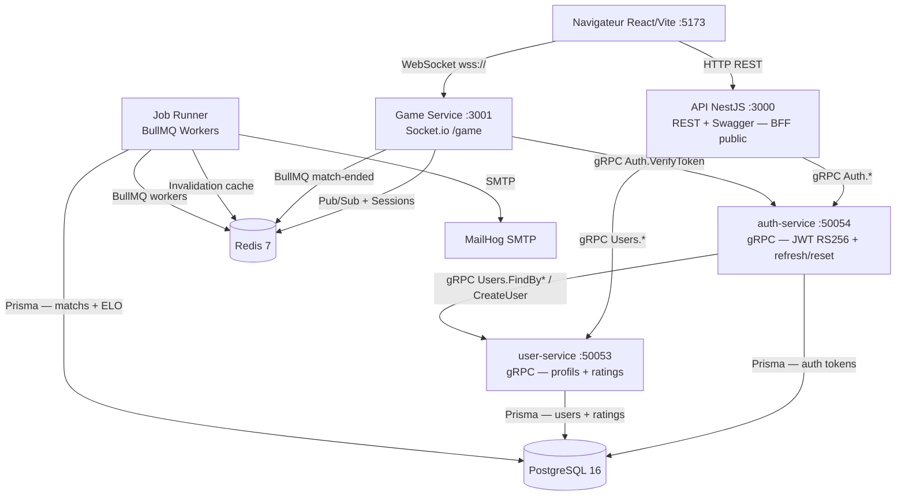
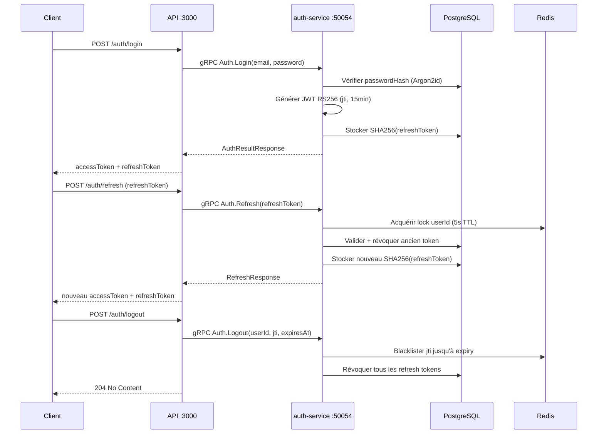
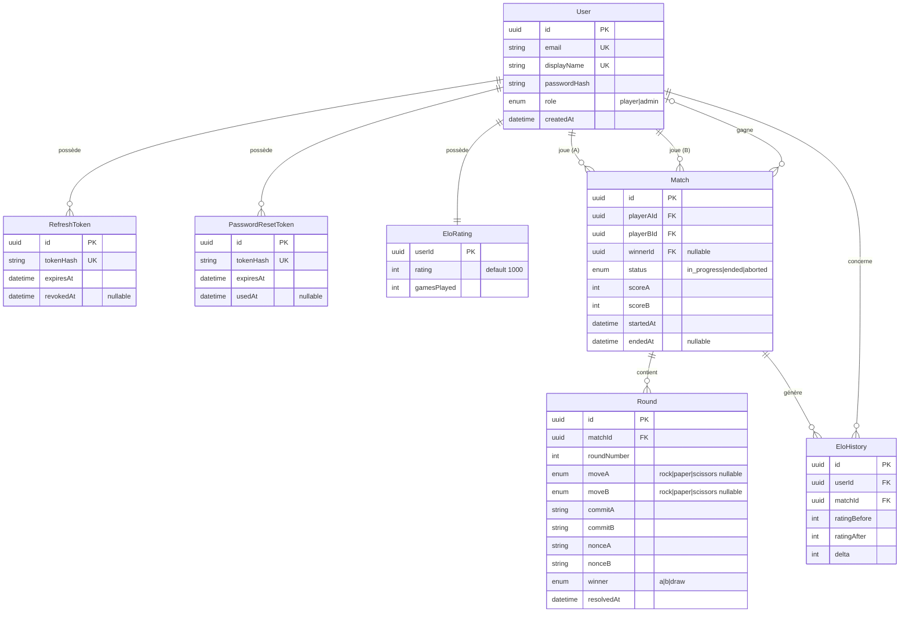
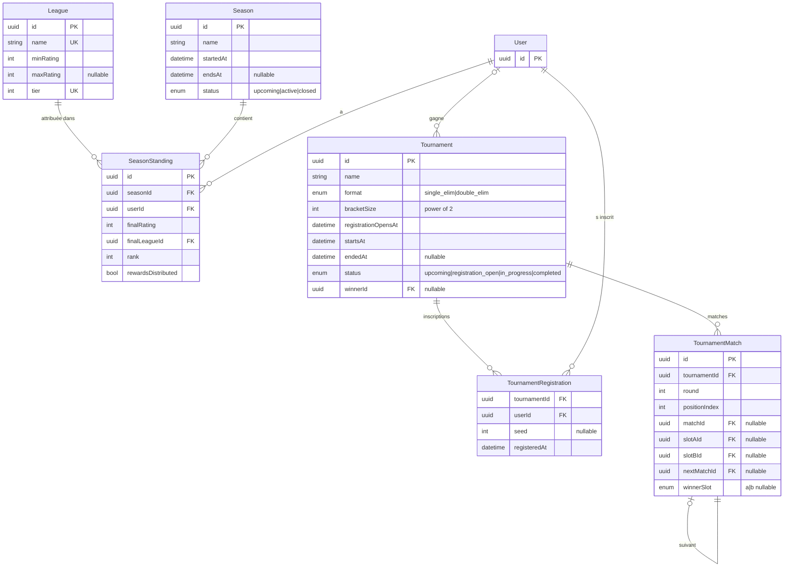
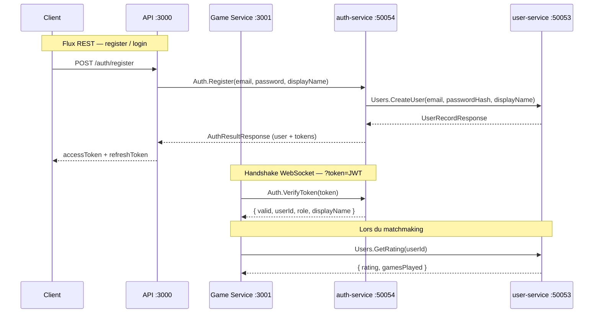
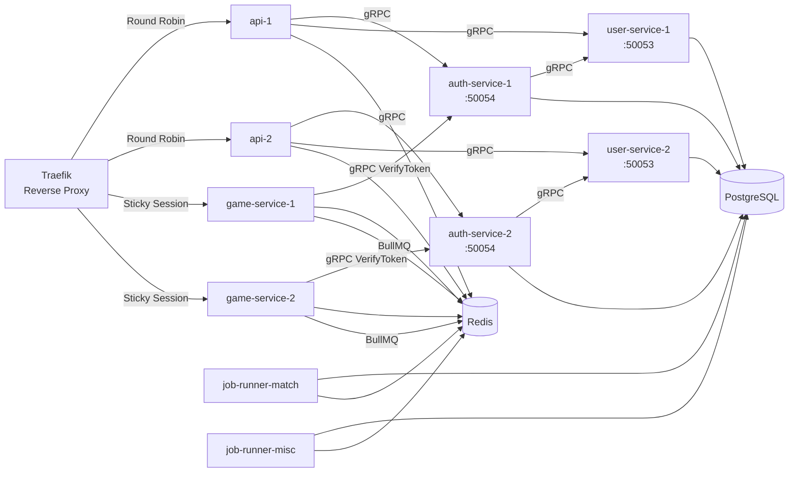
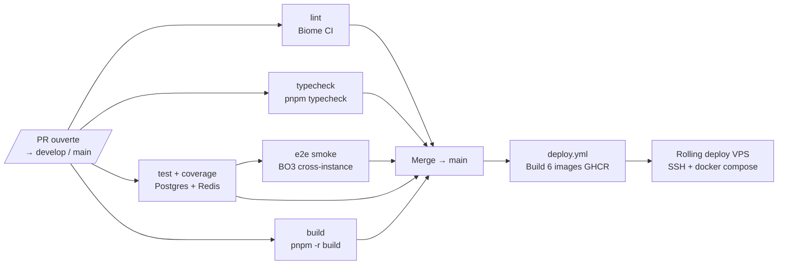

# Chifoumi Ranked ✊✋✌️

**Plateforme web compétitive Pierre-Feuille-Ciseaux**

Matchmaking ELO · Parties BO3 temps réel · Anti-triche commit-reveal

<div class="pt-8 text-sm opacity-60">Ynov — Expert Développement Web · Module WebService · 2026</div>

---
layout: two-cols
---

# L'équipe

<v-clicks>

- **[Adrien]** - Product Owner · Auth & JWT
- **[Eliot]** - ELO Engine & Matchmaking
- **[Florentin]** - BO3 State Machine & Anti-triche
- **[Rayan]** - Job Runner & Notifications
- **[Charles]** - DevOps · CI/CD · Observabilité

</v-clicks>

::right::

<div class="pl-4 pt-8">

**Rôles transverses**

- Architect : monorepo PNPM, TypeScript strict
- Reviewer : convention Conventional Commits, PR obligatoire
- QA : couverture de tests par seuils CI

</div>

---
layout: default
---

# Le pitch - 1 min 30

<v-clicks>

**Le problème** : Pierre-Feuille-Ciseaux est trivial à tricher en ligne — un joueur peut choisir son coup *après* avoir vu celui de l'adversaire.

**La solution** : Chifoumi Ranked implémente un protocole **commit-reveal** anti-triche inspiré de la cryptographie, couplé à un moteur ELO complet pour un classement compétitif juste.

**Ce qu'on a construit :**
- 6 services découplés (API, auth-service, user-service, Game Service, Job Runner, Front)
- Matchmaking par fenêtre ELO sur Redis
- Parties Best-of-3 en temps réel via WebSocket
- Persistance async des résultats via BullMQ
- Stack multi-réplicas tolérante aux pannes

**Pour qui :** tout joueur souhaitant prouver qu'il maîtrise vraiment le RPS — pas juste la chance.

</v-clicks>

---
layout: section
---

# Démonstration

*Matchmaking · Partie BO3 · Anti-triche commit-reveal · Multi-réplicas*

---
layout: section
---

# Architecture technique

*10 minutes · Contrôleurs · Auth · BDD · Redis · BullMQ · CI/CD*

---
layout: default
---

# Vue d'ensemble

<div class="overflow-y-auto h-[430px]">



</div>

---
layout: default
---

# Structure du monorepo

<div class="grid grid-cols-2 gap-4 text-sm">
<div>

```
apps/
├── api/          ← REST + Swagger (BFF public)
├── auth-service/ ← gRPC JWT RS256 + refresh
├── user-service/ ← gRPC profils + ratings
├── game-service/ ← Socket.io /game
├── job-runner/   ← BullMQ workers
└── front/        ← React + Vite
```

</div>
<div>

```
packages/
├── db/       ← Prisma schema + migrations
├── elo/      ← Moteur ELO pur
├── bracket/  ← Logique bracket tournois
├── leagues/  ← Tiers ELO
├── schemas/  ← Zod WS events + commit-hash
└── proto/    ← Définitions gRPC

.github/workflows/
├── pr.yml     ← lint + typecheck + test + e2e
└── deploy.yml ← GHCR + rolling VPS deploy
```

</div>
</div>

> **Règle clé :** Game Service → jamais Postgres (BullMQ → Job Runner). `auth-service` / `user-service` internes, non exposés par Traefik.

---
layout: default
---

# API — Contrôleurs & routes (1/2)

| Contrôleur                | Route                        | Auth   | Description                    |
|---------------------------|------------------------------|--------|--------------------------------|
| **AuthController**        | `POST /auth/register`        | Public | Inscription + tokens           |
|                           | `POST /auth/login`           | Public | Connexion                      |
|                           | `POST /auth/refresh`         | Public | Rotation refresh token         |
|                           | `POST /auth/logout`          | JWT    | Blacklist + révocation         |
|                           | `POST /auth/forgot-password` | Public | Email reset (anti-enum)        |
|                           | `POST /auth/reset-password`  | Public | Reset avec token opaque        |
| **MeController**          | `GET /me`                    | JWT    | Profil + ELO                   |
|                           | `GET /me/history`            | JWT    | Historique (cursor-paginé)     |
| **UsersController**       | `GET /users/:id/profile`     | JWT    | Profil public                  |
| **LeaderboardController** | `GET /leaderboard`           | Public | Top ELO (cache Redis 30 s)     |
| **MatchesController**     | `GET /matches/:id/audit`     | Public | Audit commit-reveal            |
| **HealthController**      | `GET /health`                | Public | Santé + gRPC readiness         |
| **JwksController**        | `GET /.well-known/jwks.json` | Public | Clé publique RS256             |

---
layout: default
---

# API — Contrôleurs & routes (2/2)

| Contrôleur                     | Route                                | Auth  | Description                                   |
|--------------------------------|--------------------------------------|-------|-----------------------------------------------|
| **SeasonsController**          | `GET /seasons/current`               | JWT   | Saison active + classement joueur             |
|                                | `GET /seasons/closed`                | Public| Saisons terminées                             |
|                                | `GET /seasons/:id/standings`         | Public| Classement saisonnier (paginé, filtre league) |
| **AdminSeasonsController**     | `POST /admin/seasons`                | Admin | Créer une saison                              |
|                                | `PATCH /admin/seasons/:id/close`     | Admin | Clôturer une saison                           |
| **TournamentsController**      | `GET /tournaments`                   | JWT   | Liste des tournois                            |
|                                | `GET /tournaments/:id`               | JWT   | Détail d'un tournoi                           |
|                                | `POST /tournaments/:id/register`     | JWT   | Inscription                                   |
|                                | `DELETE /tournaments/:id/register`   | JWT   | Désinscription                                |
| **AdminTournamentsController** | `POST /admin/tournaments`            | Admin | Créer un tournoi                              |
|                                | `PATCH /admin/tournaments/:id/open`  | Admin | Ouvrir les inscriptions                       |
|                                | `PATCH /admin/tournaments/:id/start` | Admin | Démarrer le tournoi                           |

---
layout: default
---

# Authentification — JWT RS256 + Refresh Rotation

<div class="overflow-y-auto h-[380px] pr-1">



</div>

**Sécurité :** Argon2id `memoryCost:19456, timeCost:2` · RS256 · blacklist Redis · rotation atomique

---
layout: default
---

# Base de données — Schéma Prisma (core)

<div class="overflow-y-auto h-[400px]">



</div>

---
layout: default
---

# Base de données — Features compétitives

<div class="overflow-y-auto h-[400px]">



</div>

---
layout: default
---

# Redis — Table des clés

| Clé                            | Type Redis               | TTL                   | Justification                                             |
|--------------------------------|--------------------------|-----------------------|-----------------------------------------------------------|
| `blacklist:{jti}`              | String                   | Durée restante du JWT | Invalidation immédiate au logout                          |
| `matchmaking:queue`            | Sorted Set (score = ELO) | —                     | File triée par rating pour le matchmaking                 |
| `matchmaking:inQueue:{userId}` | String                   | —                     | Déduplication : empêche double inscription                |
| `match:session:{matchId}`      | Hash                     | Durée du match        | État in-memory partagé entre les réplicas                 |
| `socket:user:{userId}`         | String (instanceId)      | —                     | Routage cross-réplica des événements WS                   |
| `leaderboard:top`              | String (JSON sérialisé)  | 30 s                  | Cache du classement (évite les lectures DB répétées)      |
| `refresh:lock:{userId}`        | String (NX)              | 5 s                   | Prévention des races conditions sur le refresh concurrent |
| `bull:{prefix}:*`              | Structures BullMQ        | Selon job             | Queues, états et résultats des jobs asynchrones           |

---
layout: default
---

# BullMQ — Queues asynchrones

| Queue           | Job                    | Statut       | Rôle                                                                                               |
|-----------------|------------------------|--------------|----------------------------------------------------------------------------------------------------|
| `match-events`  | `match-ended`          | ✅ Implémenté | Persiste les rounds en DB, calcule et applique les deltas ELO, invalide le cache leaderboard Redis |
| `notifications` | `welcome-email`        | ✅ Implémenté | Envoie l'email de bienvenue après inscription                                                      |
| `notifications` | `password-reset-email` | ✅ Implémenté | Envoie le lien de reset de mot de passe                                                            |
| `seasons`       | `season-reset`         | ✅ Implémenté | Clôture la saison, calcule les standings finaux et distribue les récompenses                       |
| `tournaments`   | `generate-bracket`     | ✅ Implémenté | Génère le bracket (single/double élimination) et lance les premiers matchs via gRPC Game Service   |

**Deux workers Docker distincts :**
- `job-runner-match` → écoute `match-events`
- `job-runner-misc` → écoute `notifications`, `seasons`, `tournaments` + cron

**Isolation par `BULLMQ_PREFIX`** : les environnements dev/staging/prod n'interfèrent pas.

---
layout: default
---

# gRPC — Communication inter-services

<div class="overflow-y-auto h-[380px]">



</div>

**Frontières de responsabilité**
- `auth-service` : JWT RS256, Argon2id, refresh rotation, blacklist Redis
- `user-service` : enregistrements users, ratings ELO, leaderboard, profils
- Le Game Service n'accède jamais à Prisma — il passe par gRPC
- L'API est un BFF pur : elle orchestre, ne stocke pas

---
layout: default
---

# Déploiement multi-réplicas

<div class="overflow-y-auto h-[400px]">



</div>

**Sessions sticky** sur le Game Service (WebSocket) · **Round-robin** sur l'API (stateless) · `auth-service` / `user-service` internes, non exposés par Traefik · Redis : seul état partagé entre réplicas.

---
layout: default
---

# CI/CD — Pipeline GitHub Actions

<div class="overflow-y-auto h-[380px]">



</div>

**Artefacts CI :** rapports de couverture `lcov` uploadés à chaque PR. **Conditions de merge :** lint vert + typecheck vert + tous les tests passants.

---
layout: default
---

# Couverture de tests

| Package             | Runner | Seuil lignes | Seuil branches | Seuil fonctions | Résultat actuel         |
|---------------------|--------|--------------|----------------|-----------------|-------------------------|
| `apps/api`          | Jest   | 70 %         | 60 %           | 70 %            | ~91 % / ~80 % / ~89 % ✅ |
| `apps/game-service` | Jest   | 70 %         | 60 %           | 70 %            | ✅ CI verte              |
| `apps/job-runner`   | Jest   | 70 %         | 60 %           | 70 %            | ✅ CI verte              |
| `packages/elo`      | Jest   | **95 %**     | **95 %**       | **100 %**       | ✅ 100 %                 |
| `apps/front`        | Vitest | 60 %         | 50 %           | —               | ~79 % / ~83 % ✅         |

**Exclusions justifiées :** DTOs, fichiers bootstrap `main.ts`, code généré Prisma/gRPC, pages CRUD triviales du front.

Les seuils sont **enforced en CI** — une PR qui fait baisser la couverture sous le seuil est bloquée automatiquement.

---
layout: section
---

# Présentations individuelles

*5 membres · 5 min chacun*

---
layout: default
---

# [Adrien] — Auth JWT RS256 & Refresh Token Rotation

**Problématique :** comment invalider un JWT (stateless par nature) et prévenir les races conditions sur le refresh ?

<v-clicks>

**Solution mise en place :**

1. Chaque access token porte un `jti` (UUID v4) unique
2. Au logout → `jti` blacklisté dans Redis avec TTL = durée restante du JWT
3. Chaque requête authentifiée → vérification blacklist Redis (`JwtStrategy`)
4. Refresh token = 32 bytes aléatoires, stocké en DB sous forme `SHA256(token)`
5. Rotation atomique : lock Redis `NX` 5s sur `userId` → transaction DB revoke/create

</v-clicks>

---
layout: default
---

# [Adrien] — Implémentation clé

```ts {all|8-13|16-21|23-27}
// token.service.ts
async issueAccessToken(input: {
  userId: string; role: string; displayName: string;
}): Promise<{ accessToken: string }> {
  const jti = uuidv4();
  const accessToken = await this.jwtService.signAsync(
    { sub: input.userId, role: input.role, jti, displayName: input.displayName },
    { algorithm: "RS256", expiresIn: this.jwtConfig.accessTtlSeconds },
  );
  return { accessToken };
}

issueRefreshToken(): { refreshToken: string; refreshTokenHash: string } {
  const refreshToken = randomBytes(32).toString("base64url");
  return {
    refreshToken,
    refreshTokenHash: createHash("sha256").update(refreshToken).digest("hex"),
  };
}
```

**RS256** (asymétrique) : le Game Service vérifie les tokens avec la clé publique via JWKS — sans partager de secret.

---
layout: default
---

# [Eliot] — Moteur ELO (`packages/elo`)

**Problématique :** calculer l'évolution du rating ELO de façon juste, testable et indépendante de tout framework.

<v-clicks>

**Solution mise en place :**

- Package `@chifoumi/elo` — **zéro dépendance framework** (NestJS, Prisma, Redis)
- Formule ELO standard avec **K-factor variable** :
  - K=40 si moins de 30 parties (joueur débutant, ajustement rapide)
  - K=16 si rating > 2400 (joueur expert, stabilité)
  - K=32 sinon (standard FIDE)
- Couverture : **95 %+ lignes/branches, 100 % fonctions** — CI bloque si on descend en dessous

</v-clicks>

---
layout: default
---

# [Eliot] — Implémentation clé

```ts {all|1-8|10-16|18-22}
// computeElo.ts
export function computeElo(
  ratingA: number, ratingB: number,
  winner: Outcome,
  gamesPlayedA: number, gamesPlayedB: number,
): EloResult {
  const kFactorA = getKFactor(ratingA, gamesPlayedA);
  const kFactorB = getKFactor(ratingB, gamesPlayedB);
  const expectedA = 1 / (1 + 10 ** ((ratingB - ratingA) / 400));
  const expectedB = 1 - expectedA;
  const { scoreA, scoreB } = getScorePair(winner); // 1/0/0.5
  const deltaA = Math.round(kFactorA * (scoreA - expectedA));
  const deltaB = Math.round(kFactorB * (scoreB - expectedB));
  return { newRatingA: ratingA + deltaA, newRatingB: ratingB + deltaB, deltaA, deltaB };
}

// kFactor.ts
export function getKFactor(rating: number, gamesPlayed: number): number {
  if (rating > 2400) return 16;   // expert → stabilité
  if (gamesPlayed < 30) return 40; // débutant → ajustement rapide
  return 32;                       // standard
}
```

---
layout: default
---

# [Florentin] — BO3 State Machine & Anti-triche Commit-Reveal

**Problématique :** garantir qu'un joueur ne peut pas choisir son coup *après* avoir vu celui de l'adversaire.

<v-clicks>

**Solution — Protocole commit-reveal :**

1. **Phase commit** : le client envoie `SHA256(coup + ":" + nonce)` — le coup est caché mais engagé
2. **Phase reveal** : une fois les deux commits reçus, chaque joueur révèle coup + nonce en clair
3. **Vérification** : le serveur recalcule `SHA256(coup:nonce)` et compare au commit initial
4. Si mismatch → tricherie détectée, round invalidé, trace dans l'audit trail public

**State machine BO3 :** `WAITING_PLAYS` → `RESOLVING` → `WAITING_PLAYS` (round suivant) ou `ENDED`

</v-clicks>

---
layout: default
---

# [Florentin] — Implémentation clé

```ts {all|1-5|7-15}
// packages/schemas/src/commit-hash.ts
export function computeCommitHash(move: string, nonce: string): string {
  return createHash("sha256").update(`${move}:${nonce}`).digest("hex");
}

export function verifyCommit(
  commit: string | null | undefined,
  move: string | null | undefined,
  nonce: string | null | undefined,
): HashCheckResult {
  if (!commit || !move || !nonce) return "mismatch";
  return computeCommitHash(move, nonce) === commit ? "match" : "mismatch";
}
```

**Audit public** : `GET /matches/:id/audit` expose les commits, nonces et moves de chaque round → n'importe qui peut vérifier qu'aucun joueur n'a triché.

---
layout: default
---

# [Rayan] - Job Runner & BullMQ

**Problématique :** le Game Service est temps réel — persister les matchs et envoyer des emails de façon synchrone bloquerait le WebSocket.

<v-clicks>

**Solution — Architecture asynchrone BullMQ :**

1. À la fin d'un match, le Game Service enqueue `match-ended` dans Redis (BullMQ)
2. Le Job Runner consomme le job : valide le payload Zod, persiste rounds + ELO en DB, invalide le cache leaderboard
3. Les notifications (email bienvenue, reset password) sont enqueued par l'API et traitées par un worker dédié
4. **Idempotence** : `persistenceStatus === "already_exists"` → pas de doublon en cas de retry

</v-clicks>

---
layout: default
---

# [Rayan] - Implémentation clé

```ts {all|1-10|12-20}
// match-ended.processor.ts
export function createMatchEndedProcessor(deps: MatchEventsProcessorDependencies) {
  return async (job: Job) => {
    if (job.name !== "match-ended") {
      throw new UnrecoverableError(`Unsupported job: ${job.name}`);
    }

    const parsed = matchEndedPayloadSchema.safeParse(job.data);
    if (!parsed.success) {
      throw new UnrecoverableError("Invalid match-ended payload");
    }

    const status = await deps.matchPersistence.persistMatchEnded(
      parsed.data as MatchEndedPayload,
    );
    if (status === "created" || status === "already_exists") {
      await deps.redisInvalidation.invalidateLeaderboard();
    }
  };
}
```

`UnrecoverableError` = pas de retry BullMQ (payload invalide → erreur définitive, pas de boucle infinie).

---
layout: default
---

# [Charles] - CI/CD, Docker multi-réplicas & Observabilité

**Problématique :** comment garantir que chaque PR est déployable, et que la production est tolérante aux pannes d'un réplica ?

<v-clicks>

**CI — `pr.yml` (5 jobs parallèles) :**
- `lint` : Biome CI (format + lint)
- `typecheck` : TypeScript strict sur tout le monorepo
- `test` : Jest + Vitest avec seuils de couverture (Postgres + Redis réels)
- `build` : `pnpm -r build` tous les packages
- `e2e` : smoke test BO3 cross-instance (2 réplicas game-service distincts)

**CD — `deploy.yml` :**
- Build & push 6 images Docker vers GHCR (api, auth-service, user-service, game-service, job-runner, front)
- SSH rolling deploy VPS via `docker-compose.prod.yml`
- Smoke post-deploy : `/health`, Swagger, front

</v-clicks>

---
layout: default
---

# [Charles] - Stack multi-réplicas

<div class="grid grid-cols-2 gap-4">
<div>

```yaml
# docker-compose.scale.yml (extrait)
api-1: &api
  labels:
    - "traefik.http.routers.api.rule=Host(`api.localhost`)"
    - "traefik.http.services.api.loadbalancer.server.port=3000"
api-2: *api  # round-robin automatique

game-service-1: &game
  labels:
    - "traefik.http.services.game.loadbalancer.sticky.cookie=true"
game-service-2: *game  # sticky WebSocket
```

</div>
<div>

**Résilience démontrée :**

```bash
docker stop chifoumi-api-1
# api-2 répond toujours
curl http://api.localhost/health
docker start chifoumi-api-1
```

Redis = seul état partagé.  
Sessions WS, blacklist JWT et queues BullMQ **survivent** à la perte d'un réplica.

</div>
</div>

---
layout: end
---

# Questions ?

*Merci pour votre attention.*

<div class="mt-8 text-sm opacity-60 grid grid-cols-2 gap-4">
<div>

**Liens utiles (dev)**
- Front : `http://localhost:5173`
- API : `http://localhost:3000/api/docs`
- Grafana : `http://localhost:3030`
- MailHog : `http://localhost:8025`

</div>
<div>

**Commandes de démo**
```bash
docker compose up -d
pnpm dev
# Stack multi-réplicas :
docker compose -f docker-compose.yml \
  -f docker-compose.scale.yml up -d
```

</div>
</div>
